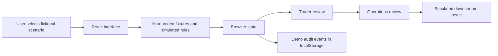

# Financial Workflow → AI Agent Prototype

An interactive portfolio example showing how I translate business interviews and financial workflow analysis into an AI Agent product concept.

**This is a hard-coded, frontend-only interview demo. There is no backend, live AI/model inference, bank integration, email delivery, or production database. All business results are simulated.**

本项目是用于求职面试的交互原型示例，展示我如何通过业务访谈（business interviews）理解金融业务需求、拆解 finance workflows，识别 AI Agent 的应用机会，并将需求转化为可演示的产品流程。

**全部是 hard-coded 的纯前端模拟，没有任何真实后端系统，也没有调用真实 AI 模型。** 本示例用于说明我的业务理解、工作流拆解与 AI Agent 落地方案设计能力，不代表已经完成生产级部署，也不代表任何机构实际采用或认可了该方案。

## What this demonstrates / 展示能力

| Capability | How it appears in the prototype |
| --- | --- |
| Business discovery / 业务访谈 | Translate product-launch needs into roles, inputs, outputs and review steps. |
| Workflow decomposition / 流程拆解 | Separate classification, screening, document review, code creation and handoffs. |
| AI Agent solution design / 方案设计 | Show where assistance could extract, summarize and prepare information. |
| Human controls / 人工控制 | Keep Trader confirmation and Operations review visible before downstream actions. |
| Exception handling / 异常处理 | Demonstrate a sanction hard stop and template validation exceptions. |
| Product prototyping / 原型实现 | Make the proposed experience explorable through an interactive React interface. |

This repository is an illustrative reconstruction with fictional scenario identifiers and generic branding. It contains no interview transcripts, original client attachments, internal requirements, or source repository history. It does not substantiate production performance or business impact.

## Run locally

Use Node.js 22.12+ and npm.

```bash
npm ci
npm run dev
```

Open `http://localhost:3000`. No credentials or environment variables are required.

```bash
npm run build
npm test
npm run lint
```

`npm run preview` serves the production build locally. Vite serves static frontend assets; it is not a business backend.

## Interview walkthrough / 面试演示路线

1. Start in the **Trader** role and select **Launch New ELI** (the demo entry also offers Bond scenarios).
2. On the upload screen, choose one of the built-in fictional presets: **Complex ELI**, **Standard ELI**, **Primary Bond**, **Secondary Bond**, or **Sanction Block**. No file is needed.
3. Follow the simulated processing steps and review the extracted fields. ELI cases include a launch-document lane; Bond cases proceed toward product-code review.
4. Complete the visible Trader confirmations, then switch to **Operations** to inspect template values, exceptions and approval controls.
5. Follow the simulated downstream submission and inspect the returned code and audit events.
6. Use **Reset** to restore the demo. Run **Sanction Block** to demonstrate the early-stop path.

The optional file selector uses a filename to select a preset. It does not read, parse or upload the file contents. Original attachments and downloadable office files are excluded; launch documents use browser-rendered fictional summaries, and template values are reviewed within the UI.

## Architecture / 架构



There is no backend or model service in this diagram. COPIA, Summit and Outlook references in the UI illustrate proposed handoffs only; no connection is made to those systems. Role switching is a presentation control, not authentication or authorization. Audit events stored in the browser are editable demo data, not a secure audit trail. Other case state resets on page reload.

## Scope / 模拟边界

| UI behavior | Actual implementation |
| --- | --- |
| AI classification, extraction and screening | Predefined results selected by scenario. |
| Launch-document generation | Simulated document records and frontend summaries. |
| Approvals and validation | Browser state and illustrative rules. |
| Outlook delivery | Draft preview and simulated status changes; no email sent. |
| System upload and product codes | Simulated state transitions and preset references. |
| Notifications and audit trail | Local UI events; no external notification service. |

A production implementation would require backend services, model integration, system connectors, authentication, authorization, secure auditing, data governance and business validation. These are future implementation requirements, not completed features of this prototype.

## Code map

- `src/demo/mock.ts` — fictional scenarios and predefined terms.
- `src/demo/store.tsx` — workflow state, transitions and simulated outcomes.
- `src/demo/templateRules.ts` — illustrative template rules.
- `src/pages/` — Trader, Operations and review screens.
- `src/components/` — reusable UI and preview components.
- `docs/` — screenshot of the public edition.

## Preview


## Sharing / 方式四：公开核心 Demo 仓库

此仓库是面向招聘人员及面试官的独立展示版本，仅保留核心前端逻辑、虚构示例及说明。公开仓库可以被查看和复制；临时演示链接适合短期展示，但不能使前端代码保密。

核心说明：**这是一个举例说明业务访谈、金融工作流拆解和 AI Agent 方案设计能力的纯前端原型，不是可处理真实业务的 AI Agent 系统。**
