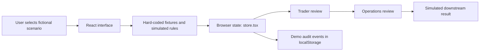
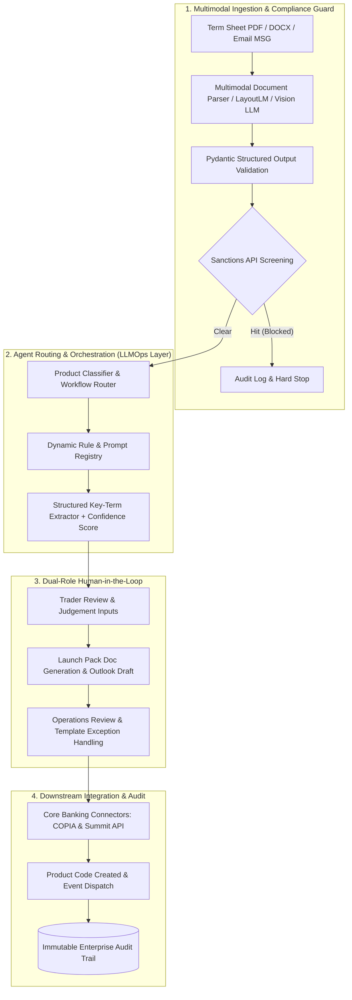
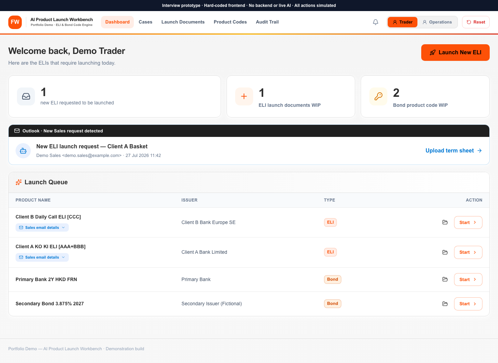

# Financial Workflow → AI Agent Prototype

An interactive portfolio example showing how I translate business interviews and financial workflow analysis into an AI Agent product concept.

**This is a hard-coded, frontend-only interview demo. There is no backend, live AI/model inference, bank integration, email delivery, or production database. All business results are simulated.**

本项目是用于求职面试的交互原型示例，展示我如何通过业务访谈（business interviews）理解金融业务需求、拆解 finance workflows，识别 AI Agent 的应用机会，并将需求转化为可演示的产品流程。

**全部是 hard-coded 的纯前端模拟，没有任何真实后端系统，也没有调用真实 AI 模型。** 本示例用于说明我的业务理解、工作流拆解与 AI Agent 落地方案设计能力，不代表已经完成生产级部署，也不代表任何机构实际采用或认可了该方案。

> 📖 **Interviewers & Reviewers**: Check out the comprehensive [Interview & Presentation Playbook (STAR Framework & Q&A Defense)](docs/interview-guide.md) for live demo talking points and technical defense strategies.

---

## What this demonstrates / 展示能力

| Capability | How it appears in the prototype |
| --- | --- |
| **Business discovery / 业务访谈** | Translate product-launch needs across Front/Middle/Back Office into roles, inputs, outputs, and review steps. |
| **Workflow decomposition / 流程拆解** | Separate classification, sanction screening, document generation, code creation, and inter-desk handoffs. |
| **AI Agent solution design / 方案设计** | Show where AI assistance extracts unstructured terms, routes workflows, and drafts client-facing materials. |
| **Human controls / 人工控制** | Keep Trader confirmation and Operations review visible before any downstream core-banking actions. |
| **Exception handling / 异常处理** | Demonstrate automated sanction hard-stops and manual Operations template correction loops. |
| **Product prototyping / 原型实现** | Make the proposed experience tangible through a reactive, dual-role React 19 interface. |

This repository is an illustrative reconstruction with fictional scenario identifiers and generic branding. It contains no interview transcripts, original client attachments, internal requirements, or source repository history. It does not substantiate production performance or business impact.

---

## Business Discovery & Pain Points / 业务访谈与痛点拆解

In capital markets and wealth management, issuing structured equity derivatives (e.g., Equity-Linked Investments / ELI) or onboarding secondary bonds involves cross-departmental handoffs between Sales, Trading, and Operations:

1. **Unstructured Data Ingestion**: Trade requests arrive as free-form emails, complex PDF term sheets, and market data terminal screenshots.
2. **High-Stakes Manual Re-Entry**: Traders and Operations manually re-key terms across Excel workbooks and legacy core banking platforms (e.g., COPIA for instrument inventory and Summit for treasury settlement).
3. **Calculation & Regulatory Risks**: Manual errors in maturity-to-settlement calendar rules (`T+2` across multi-currency jurisdictions) or unauthorized underlying selections can cause severe settlement failures or regulatory penalties.
4. **The Agentic Opportunity**: An AI Agent pipeline acts as a deterministic orchestrator—handling OCR extraction, rules-based screening, legal doc generation, and template population under explicit human oversight.

---

## Run locally

Use Node.js 22.12+ and npm.

```bash
npm ci
npm run dev
```

Open `http://localhost:3000`. No credentials or environment variables are required.

```bash
npm run build
npm test
npm run lint
```

`npm run preview` serves the production build locally. Vite serves static frontend assets; it is not a business backend.

---

## Interview Walkthrough / 面试演示路线

The demo features 3 representative scenarios illustrating different aspects of financial workflow orchestration:

### 1. Happy Path: Complex ELI (Demonstrates Business Depth & Bidirectional Sync)
1. In the **Trader** role, inspect incoming Outlook requests and launch **Complex ELI** (`Client A Basket`).
2. Observe the 4-stage AI pipeline: classification as a Daily Autocall + At-Expiry Knock-In structure (`ELI_COMPLEX_V1`).
3. In the **Case Workspace**, review field-level data provenance (`term-sheet`, `sales-email`, `rule-derived`).
4. Complete required human inputs (e.g., `Product Risk Rating: P5`). Edit the `Maturity Date` and observe how downstream `Settlement Date` automatically recalculates according to multi-centre business day rules (`T+2`).
5. Review and approve the generated legal launch pack (*Product Booklet, Application Form, FDD, Disclosure*).
6. Preview the rich HTML **Outlook Draft** and trigger email dispatch to sales distribution.

### 2. Exception Path: Secondary Bond (Demonstrates Operations Fault Tolerance)
1. Switch to the **Operations** role and open the **Secondary Bond** case. Notice that bonds bypass retail launch packs and route directly to code creation.
2. Inspect `COPIA.xlsx` and `Summit.xlsx` templates.
3. Observe the validation warning on **NBMCE**: Value `8` from the email request is outside the valid parameter range `[0..5]`.
4. Correct the value in the UI to resolve the exception, approve templates, and simulate system code generation (`BDSECOND20260430A`).

### 3. Defensive Governance: Sanction Block (Demonstrates Compliance Hard-Stops)
1. Select **Sanction Block** from the launch screen.
2. Observe the agent pipeline immediately terminating at the screening phase due to an underlying entity match (`DEMO-SANCTIONED-ENTITY`).
3. Inspect the **Audit Trail** to verify the tamper-evident log entry (`Tone: Danger`). No downstream documents or codes are generated.

---

## Architecture / 架构

### 1. Prototype Architecture (Client-Side Simulation)

The current repository is an offline, deterministic state machine built with React Context:



### 2. Target Production Architecture (LLMOps & Enterprise Integration)

In an institutional production deployment, this workflow maps to a secure cloud-native architecture combining multimodal extraction, deterministic guardrails, and enterprise core-banking connectors:



---

## How AI is Applied & Evaluated / AI 应用与工程思考

When presenting this project, AI integration should be discussed across two distinct dimensions:

### 1. AI in System Architecture (Product Design)
- **Document-to-Schema Extraction**: Applying vision-language models with constrained JSON decoding (Pydantic / Instructor) to extract structured financial parameters with visual bounding-box citations.
- **Provenance & Confidence Scoring**: Tagging every field with source lineage and an extraction confidence metric to highlight low-confidence items for mandatory human inspection.
- **Workflow Routing & Template Selection**: Classifying complex derivative structures (e.g., autocallable barrier options vs. vanilla fixed income) to automatically dynamically select legal document packs and core-banking field mappings.
- **Hallucination Mitigation**: Enforcing mathematical consistency checks post-extraction (e.g., validating that `Knock-In < Strike < 100%` and `Maturity Date > Issue Date`) before human presentation.

### 2. AI-Assisted Engineering (Development Efficiency)
- **Accelerated Prototyping**: Leveraging modern AI coding assistants to design complex financial date arithmetic (`store.test.ts`), multi-field bidirectional synchronization, and high-fidelity enterprise UI components.

---

## Scope / 模拟边界

| UI behavior | Actual implementation |
| --- | --- |
| AI classification, extraction and screening | Predefined results selected by scenario. |
| Launch-document generation | Simulated document records and frontend summaries. |
| Approvals and validation | Browser state and illustrative rules. |
| Outlook delivery | Draft preview and simulated status changes; no email sent. |
| System upload and product codes | Simulated state transitions and preset references. |
| Notifications and audit trail | Local UI events; no external notification service. |

A production implementation would require backend services, model integration, system connectors, authentication, authorization, secure auditing, data governance and business validation. These are future implementation requirements, not completed features of this prototype.

---

## Code map

- `src/demo/mock.ts` — fictional scenarios and predefined terms.
- `src/demo/store.tsx` — workflow state, transitions and simulated outcomes.
- `src/demo/templateRules.ts` — illustrative template rules.
- `src/demo/extractedTerms.ts` — field grouping and provenance lineage tagging.
- `src/pages/` — Trader, Operations and review screens.
- `src/components/` — reusable UI, preview and Excel viewer components.
- `docs/interview-guide.md` — interview playbook, STAR storytelling, and Q&A defense.
- `docs/` — documentation assets and illustrations.

---

## Preview



---

## Sharing / 方式四：公开核心 Demo 仓库

此仓库是面向招聘人员及面试官的独立展示版本，仅保留核心前端逻辑、虚构示例及说明。公开仓库可以被查看和复制；临时演示链接适合短期展示，但不能使前端代码保密。

核心说明：**这是一个举例说明业务访谈、金融工作流拆解和 AI Agent 方案设计能力的纯前端原型，不是可处理真实业务的 AI Agent 系统。**
