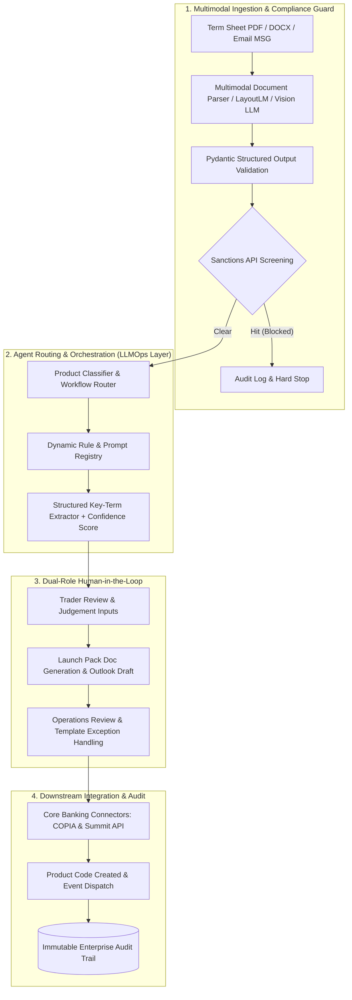

# Financial Workflow AI Agent: Interview & Presentation Playbook

This playbook provides structured talking points, business decomposition notes, live demo walkthrough scripts, and technical Q&A strategies for interviewing and presenting the **Financial Workflow → AI Agent Prototype**.

---

## 1. Elevator Pitch (30-Second Verbal Summary)

> *"This project is an interactive AI Agent prototype derived from business interviews with institutional sales, trading, and operations desks. It demonstrates how to decompose a high-friction financial workflow—structured product (ELI) launch and bond code setup—into an automated, human-in-the-loop agentic pipeline. It covers multimodal document extraction, sanction screening hard-stops, automated legal launch pack generation, and downstream system code mapping (COPIA/Summit), reducing multi-hour manual handoffs to minutes while maintaining strict enterprise regulatory controls."*

---

## 2. STAR Business Storytelling Framework

### Situation (业务痛点与行业背景)
- **High-Touch, Fragmented Flow**: In structured equity derivative and fixed-income desks, issuing a new tranche (e.g., Equity-Linked Investments / ELI) or onboarding a secondary bond involves coordination across Front Office (Sales & Traders), Middle Office (Structuring/Compliance), and Back Office (Operations/Settlement).
- **Manual Bottlenecks**: Terms arrive as unstructured data—inbound sales emails, PDF term sheets, or market data screenshots. Traders and Operations staff manually transcribe parameters across internal workbooks and legacy core banking platforms (such as COPIA and Summit).
- **Operational Risk**: Manual transcription risks catastrophic errors—such as incorrect settlement dates (`T+2` calendar rules), inverted barrier levels, or unauthorized underlying assets.

### Task (目标与任务)
- **Transform Business Interviews into Agent Architecture**: Translate qualitative desk interviews into a deterministic state machine and AI agent product concept.
- **Enforce Human-in-the-Loop & Compliance**: Maintain strict human sign-off gates, audit logging, and automated compliance barriers (e.g., anti-money laundering and sanctions screening) without hindering trade execution speed.

### Action (核心行动与方案设计)
1. **Source Lineage & Attribution**: Every extracted field is tagged with an inspectable provenance marker (`term-sheet`, `sales-email`, `rule-derived`, or `human-required`) so reviewers know whether a value came from a document or internal mapping.
2. **Deterministic Compliance Guardrails**: Designed an instant hard-stop mechanism for sanctions. If an underlying or issuer matches a watch list, the agent immediately halts processing before any downstream document or code creation.
3. **Cross-System Bidirectional Synchronization**: Built reactive dependencies where critical changes propagate automatically (e.g., updating `Maturity Date` recalculates `Settlement Date = Maturity + 2 business days` accounting for multi-centre public holidays).
4. **Operations Exception Handling**: Modeled real-world discrepancy resolution (e.g., an invalid settlement parameter like `NBMCE = 8` flagged with expected ranges for manual Ops review).

### Result (产出与收益)
- **Interactive Validation Baseline**: Developed a high-fidelity, dual-role React 19 / TypeScript prototype that functions as an unambiguous specification (PRD) for engineering teams, compliance officers, and desk heads.
- **Workflow Compression**: Demonstrated a theoretical path from a 2–4 hour turnaround per tranche down to under 5 minutes of supervised human review.

---

## 3. 3-Minute Live Demo Walkthrough Script

### Route 1: Complex ELI Happy Path (Demonstrates Business Depth & Bidirectional Sync)
1. **Start in Trader Role**:
   - Begin at the **Trader Dashboard**. Point out the pending sales requests detected from Outlook (`New ELI launch request — Client A Basket`).
   - Click **Launch New ELI** and select **Complex ELI** (Client A Basket).
2. **Review AI Processing Milestones**:
   - Show the 4 pipeline stages: *Detect & Classify* $\rightarrow$ *Extract Terms & Screen Sanctions* $\rightarrow$ *Select Workflow & Templates* $\rightarrow$ *Generate Outputs*.
   - Point out the classification reason: identified as a Daily Autocall + At-Expiry Knock-In structure (`ELI_COMPLEX_V1`).
3. **Inspect Provenance & Supply Judgement**:
   - In **Case Workspace**, highlight the source tags (Term Sheet, Sales Email, Rule/Mapping).
   - Locate the required human input: `Product Risk Rating`. Complete the field (e.g., `P5`).
   - Edit the `Maturity Date` to show reactive derivation of downstream settlement and template values.
4. **Approve Launch Pack & Outlook Draft**:
   - Navigate to **Launch Docs**: review the generated complete pack (*Product Booklet, Application Form, FDD, Disclosure*).
   - Approve the pack to reveal the **Outlook Draft Preview**. Notice the pre-rendered HTML email table and risk disclosures ready to send.
   - Click **Send Email** and hand off to Operations.

### Route 2: Secondary Bond & Operations Exception Handling (Demonstrates Fault Tolerance)
1. **Switch to Operations Role**:
   - Switch role to **Operations** and open the **Secondary Bond** case.
   - Show that Bonds bypass the retail ELI launch pack and route directly to code creation.
2. **Inspect Template Discrepancies**:
   - Open **Code Template Review** (`COPIA.xlsx` and `Summit.xlsx`).
   - Point out the yellow validation alert on **NBMCE**: Value `8` from the email request is outside the configured demo parameter range `[0..5]`.
   - Demonstrate Ops corrective action: override the field to a valid value, clear the exception, and approve the template.
3. **Trigger Downstream Code Generation**:
   - Click **Upload & Generate Codes**. Inspect the synthetic system references returned (`COPIA: BN...`, `Summit: SECO...`, Product Code: `BDSECOND20260430A`).

### Route 3: Sanctions Hard Stop (Demonstrates Defensive Governance)
1. **Trigger Sanction Block**:
   - From upload, select **Sanction Block**.
   - Show the pipeline halting immediately at the screening step.
2. **Audit Trail Verification**:
   - Navigate to **Audit Trail** and show the tamper-evident log entry: `Tone: Danger`, `Actor: AI Agent`, identifying the hit against `DEMO-SANCTIONED-ENTITY`.
   - Explain to the interviewer: *"In tier-1 finance, knowing when NOT to proceed is even more critical than full automation."*

---

## 4. Target Production Architecture (Production Roadmap)

In an enterprise environment, this prototype maps to the following cloud-native LLMOps architecture:

---

## 5. Technical Interview Q&A Defense

### Q1: "How did you use AI in this project?"
> *"I addressed AI from two perspectives:*
> 1. ***AI in System Design (The Product Layer)***: *The architecture models an Agentic workflow featuring document-to-schema extraction, confidence score estimation, zero-shot intent/product classification, and context-aware natural language email drafting. It also implements deterministic guardrails around model outputs.*
> 2. ***AI-Assisted Engineering (The Development Layer)***: *I utilized advanced AI coding agents to rapidly prototype the complex business logic, financial date arithmetic (`T+2` calendar rules), bidirectional state synchronization (`store.tsx`), and responsive dual-role user interfaces, cutting prototyping time from weeks to days."*

### Q2: "Why is this prototype frontend-only without a live backend?"
> *"In banking institutions, before provisioning cloud infrastructure or connecting to core ledgers, business stakeholders and compliance committees require concrete proof of workflow decomposition. A lightweight, deterministically reproducible frontend prototype enables rapid iteration with traders and desk heads to validate UX and business rules without data privacy, credential, or API cost overhead."*

### Q3: "How would you prevent hallucinations in a production deployment?"
> *"By implementing a three-layer defense:*
> 1. ***Constrained Decoding & Structured Outputs***: *Enforce JSON schemas using tools like Pydantic / instructor to guarantee type compliance.*
> 2. ***Source Anchoring & Visual Bounding Boxes***: *Require the model to return character offsets or bounding box coordinates for each extracted value, rendering visual citations for human reviewers.*
> 3. ***Rule-Engine Sanity Checks***: *Run business assertion checks post-extraction (e.g., ensuring `Knock-In < Strike < 100%`, `Maturity Date > Issue Date`). If an assertion fails, prompt human review rather than guessing."*
